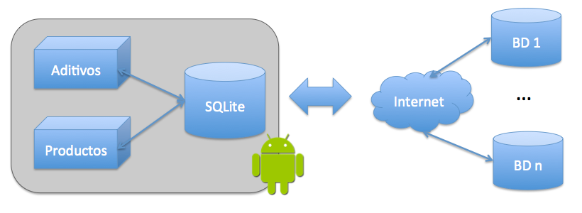
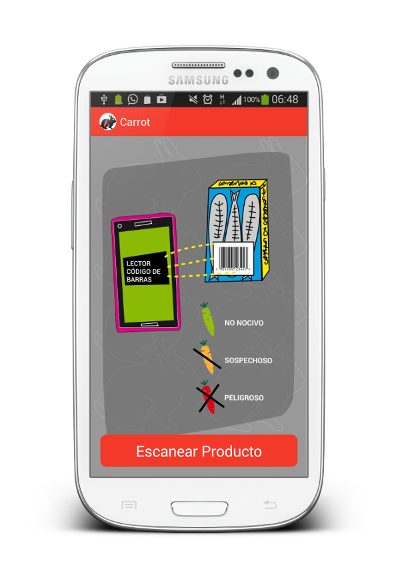
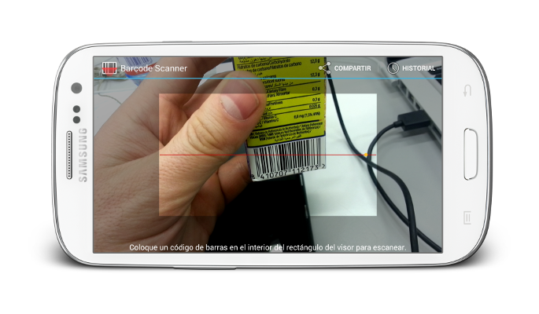
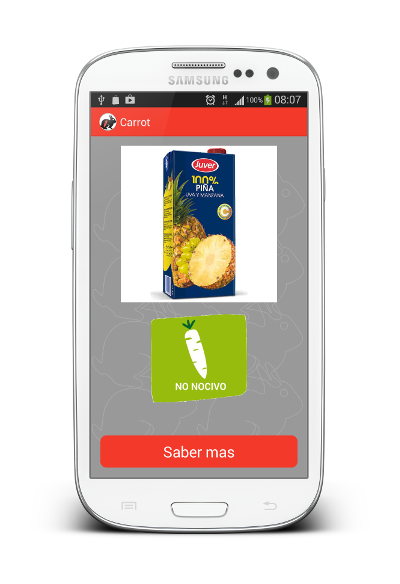

Carrot
======

Prototipo
---------

La aplicación puede descargarse desde [aquí](https://github.com/elhackaton/Equipo6/blob/master/apk/Carrot.apk).

Componentes del Equipo
---------------------

* Pedro Mármol Pérez (Contenidos)
* Liles Hernández (Diseñadora)
* Juanjo Vega Gea (Desarrollador)
* José Juan Sánchez Hernández (Desarrollador)

Descripción
-------------
### ¿Qué es?
Una original [aplicación](https://github.com/elhackaton/Equipo6/blob/master/apk/Carrot.apk) para **comprobar** los **componentes químicos** de los alimentos, indicando mediante un código de colores (rojo, naranja y verde) si su consumo es recomendable, o por el contrario, peligroso.

### Dirigida a
Consumidores interesados en el **grado de peligrosidad** de los aditivos, conservantes, colorantes, edulcorantes,...

Fuentes de datos utilizadas:
* [E-Aditivos](http://www.e-aditivos.com). Lista de aditivos nocivos en los alimentos.
* [Ecocosas](http://ecocosas.com/salud-natural/conservantes-colorantes-aditivos-edulcorantes/). Listado de conservantes, colorantes, aditivos y edulcorantes.

Estado del desarrollo actual
----------------------------

Es un prototipo funcional.

### Aditivos
* BD actual con: 257 aditivos
* Fuente: [http://www.e-aditivos.com](http://www.e-aditivos.com).
* Obtenida con Web Scrapping.

### Trabajo Futuro
* Extender el uso para conocer el origen vegetal o animal de de los alimentos.
* Mostrar información adicional de los productos consultados.
* Incorporar nuevas fuentes de datos de aditivos y productos.

### Arquitectura

  

Especificaciones Técnicas
--------------------------
* Android.
* SQLite.
* Barcode Scanner.
* Web Scraper en PHP.

Screenshots
-----------

  

  

  

Licencia
---------
[GPL3](http://www.gnu.org/licenses/gpl-3.0.html)
